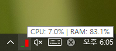

# 🖥️ 시스템 트레이 CPU/RAM 모니터


작업 표시줄(시스템 트레이)에 **CPU 및 RAM 사용률을 실시간 게이지로 시각화**해주는 경량 모니터링 도구입니다.

## 🎯 주요 기능

- 🟢 CPU / RAM 실시간 사용률 모니터링
- 📊 아이콘에 원형 게이지 또는 막대 그래프로 사용률 표시
- 🖱️ 트레이 우클릭 메뉴:
  - 시작 시 자동 실행 설정
  - 작업 관리자 바로 열기
  - 종료
- 📦 PyInstaller + UPX 기반 압축 빌드 지원 (최소 실행 파일 크기)

---

## 📸 실행 화면

| 트레이 아이콘 | 우클릭 메뉴 |
|---------------|-------------|
|  |  |

---

## 🛠️ 설치 방법

### 1. 패키지 설치
```bash
pip install -r requirements.txt
